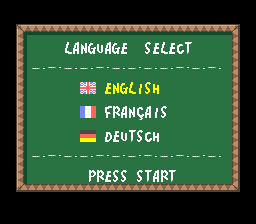

# supernes_emu

A Super Nintendo (SNES / Super Famicom) emulator written from scratch in Rust — CPU, PPU, a full audio path, and the SuperFX cartridge coprocessor, with no platform SDKs beyond a pure-Rust window/input/audio stack.

A plain-language walkthrough of how the whole thing works is in [`docs/emulateur-snes-explique.pdf`](docs/emulateur-snes-explique.pdf) (French).


*Super Mario All-Stars "SELECT GAME" menu, rendered by the emulator (background layers + sprites + color-math subscreen compositing).*

## Status

Playable rendering and audio for LoROM/HiROM games (NTSC and PAL), plus SuperFX cartridges.

| Area | State |
|---|---|
| 65C816 CPU | Full instruction set, emulation/native modes, BCD, interrupts, native-stack ops |
| SPC700 + IPL | Complete; runs games' real sound drivers |
| S-DSP audio | BRR, Gaussian interpolation, ADSR/GAIN, noise, pitch modulation, echo |
| PPU | BG modes 0–7 (2/4/8bpp), sprites, windows, color math, mosaic, HDMA, offset-per-tile, hires (5/6), interlace |
| Mode 7 | Rotation/scaling implemented + unit-tested; not yet gated on a real in-game screen |
| SuperFX (GSU) | Working — Yoshi's Island boots and renders GSU-decompressed graphics |
| DMA | GDMA + HDMA (indirect, per-line) |
| Timing / IRQ | NMI, H/V IRQ ($4207–$420A), FastROM ($420D), open-bus (MDR) |
| Cartridge | LoROM / HiROM / SuperFX detection, region detection, battery SRAM |
| Frontend | winit + pixels window, cpal audio, native macOS menu bar, ROM picker, save states, FPS overlay, headless PNG/WAV/trace dumps |

259 core unit tests pass. Verified end-to-end on four commercial games: backgrounds, sprites,
color-math menus, real in-game music (WAV-analysed), input-driven gameplay (Mario runs, jumps and
scrolls a level), H/V-IRQ raster splits, battery saves, byte-identical save-state round-trips, and
— via the from-scratch SuperFX/GSU coprocessor — Yoshi's Island booting to its language-select
screen.

<p>
  
  
</p>

Known gaps: the Super Mario World *attract-mode intro* reaches gameplay but its cutscene state
machine doesn't advance to the overworld (diagnosed, root cause not yet isolated); Mode 7,
offset-per-tile, hires and interlace are implemented and unit-tested but not yet gated on a real
in-game screen (none of the test ROMs exercise them where checked); deeper Yoshi's Island play
past language-select is untested. Other cartridge coprocessors (SA-1, DSP-1, …) are not
implemented. See `docs/PUNCHLIST.md` for the full list and `docs/IDEAS.md` for planned features.

## Build & run

Requires a recent stable Rust toolchain.

```sh
cargo build --release
cargo run --release -p snes-frontend -- path/to/game.sfc   # or .smc / .zip
cargo run --release -p snes-frontend                        # no path: opens a ROM picker
```

Launching without a ROM path (and without `--headless`) opens a native
file-open dialog filtered to `.sfc`/`.smc`/`.zip`, starting in `roms/` if that
directory exists. Cancelling the dialog exits cleanly. `--headless` still
requires an explicit ROM path (there is no window to attach a dialog to).

Controls:

| SNES | Key |
|---|---|
| D-pad | Arrow keys |
| B / A / Y / X | Z / X / A / S |
| L / R | Q / W |
| Start / Select | Enter / Right-Shift |

Emulator hotkeys: `P` pause, `N` frame-advance (while paused), `O` open a
different ROM (native file dialog; saves the current game's SRAM first,
cancelling keeps the current game running), `F5` save state, `F9` load state,
`F` toggle the FPS overlay, `Esc` quit.

The FPS overlay (off by default) draws the measured display frame rate in the
top-right corner, e.g. `FPS60/50` (frames actually presented per wall-second,
averaged over a rolling ~0.5s window, versus the cartridge region's native
field rate — 60.0988 Hz NTSC / 50.007 Hz PAL). The number is green while the
emulator keeps up with the target rate and red if it falls behind. It's drawn
directly onto the presented `pixels` frame buffer (a tiny built-in 3x5 bitmap
font, no font asset), never into the core's own framebuffer, so it never
appears in `--dump-frame`/`--dump-frame-every` PNGs or any other headless
output.

On macOS the windowed build also installs a native menu bar (top of screen):

| Menu | Item | Shortcut | Action |
|---|---|---|---|
| File | Open ROM… | Cmd+O | same as the `O` hotkey |
| File | Quit | Cmd+Q | quit (flushes battery SRAM first, same as `Esc`/window-close) |
| Emulation | Pause / Resume | Cmd+P | same as the `P` hotkey |
| Emulation | Reset | Cmd+R | reload the running ROM in place (power-on reset; keeps battery SRAM, same as pulling and re-inserting the same cartridge) |
| Emulation | Save State | Cmd+S | same as `F5` |
| Emulation | Load State | Cmd+L | same as `F9` |
| View | Show FPS | Cmd+F | same as the `F` hotkey; checkbox reflects overlay state |

Keyboard hotkeys keep working alongside the menu.

Save states snapshot the whole console (CPU/PPU/APU/DSP/DMA and all RAM) to a
`.state` sidecar next to the ROM (e.g. `game.sfc` -> `game.state`; for a
`.zip`, next to the zip using its base name). `F5`/Cmd+S writes it; `F9`/Cmd+L
restores it. The blob stores no ROM image (the running ROM is reattached on
load) and carries the ROM's checksum, so loading a state saved from a different
game is rejected and the running game is left untouched. Any load error is
printed and emulation continues.

Battery-backed cartridges save to a `.srm` sidecar next to the ROM (e.g.
`game.sfc` -> `game.srm`; for a `.zip`, next to the zip using its base name).
The save loads on startup and is written back on exit — including when you quit
via Cmd+Q or the Quit menu item, not only via `Esc`/window-close — but only if
SRAM contents actually changed (an untouched save is never rewritten). Override
the path with `--save PATH`.

### Headless / debugging

```sh
cargo run --release -p snes-frontend -- game.sfc --info                 # header, mapping, region
cargo run --release -p snes-frontend -- game.sfc --headless --frames 600 --dump-frame out.png
cargo run --release -p snes-frontend -- game.sfc --headless --frames 1500 --dump-audio out.wav
cargo run --release -p snes-frontend -- game.sfc --headless --frames 900 --dump-state statedir/  # WRAM/VRAM/CGRAM/OAM
cargo run --release -p snes-frontend -- game.sfc --disasm                # 65C816 disassembly from the reset vector
cargo run --release -p snes-frontend -- game.sfc --trace t.log --trace-start-frame 0 --trace-end-frame 2      # 65C816
cargo run --release -p snes-frontend -- game.sfc --trace-spc s.log --trace-start-frame 0 --trace-end-frame 2  # SPC700
cargo run --release -p snes-frontend -- superfx.sfc --trace-gsu g.log --trace-start-frame 0 --trace-end-frame 2  # SuperFX GSU
cargo run --release -p snes-frontend -- game.sfc --headless --frames 300 --script inputs.txt  # scripted joypad
cargo run --release -p snes-frontend -- game.sfc --save /path/to/slot1.srm  # override the default .srm sidecar
```

The 65C816 trace is Mesen2-compatible for diffing against a reference emulator; the SPC700 and
GSU traces use the same idea for the audio CPU and the SuperFX coprocessor.

### macOS app bundle

`scripts/make-app.sh` builds a double-clickable `SuperNES.app` (with icon) into `dist/`:

```sh
./scripts/make-app.sh              # release-build, then bundle
INSTALL=1 ./scripts/make-app.sh    # also copy into /Applications
SKIP_BUILD=1 ./scripts/make-app.sh # bundle the existing release binary (no rebuild)
```

Launched from Finder with no arguments, the app opens the ROM picker.

## Layout

- `core/` — `snes-core`, the pure emulation library (no I/O), fully testable headless.
  - `cpu/`, `ppu/`, `apu/`, `bus.rs`, `scheduler.rs`, `dma.rs`, `cartridge/`, `coprocessor/` (SuperFX/GSU), `debug/`
- `frontend/` — `snes-frontend`, the winit/pixels/cpal binary and CLI (picker, menu bar, save states, FPS overlay).
- `scripts/` — `make-app.sh` (macOS `.app` bundler); `packaging/` — app icon assets.
- `docs/` — architecture, the pedagogical PDF, `PUNCHLIST.md` (known accuracy gaps), `IDEAS.md` (planned features).
- `.claude/` — development tooling: subagent definitions and a condensed, source-verified SNES hardware reference (`skills/snes-refs/references/`).

## ROMs

No game ROMs are included — they are copyrighted. Supply your own `.sfc`/`.smc`/`.zip` dumps of games you own. `roms/` is git-ignored.

## License

No license granted yet; all rights reserved by the author pending a choice of open-source license.
