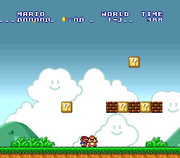

# supernes_emu

A Super Nintendo (SNES / Super Famicom) emulator written from scratch in Rust — CPU, PPU, and a full audio path, no platform SDKs beyond a pure-Rust window/input/audio stack.


*Super Mario All-Stars "SELECT GAME" menu, rendered by the emulator (background layers + sprites + color-math subscreen compositing).*

## Status

Playable rendering and audio for base-console (no cartridge coprocessors) LoROM/HiROM games, NTSC and PAL.

| Area | State |
|---|---|
| 65C816 CPU | Full instruction set, emulation/native modes, BCD, interrupts, native-stack ops |
| SPC700 + IPL | Complete; runs games' real sound drivers |
| S-DSP audio | BRR, Gaussian interpolation, ADSR/GAIN, noise, pitch modulation, echo |
| PPU | BG modes 0–6 (2/4/8bpp), sprites, windows, color math, mosaic, HDMA |
| Mode 7 | Code-complete + unit-tested, not yet validated on an in-game screen |
| DMA | GDMA + HDMA (indirect, per-line) |
| Timing / IRQ | NMI, H/V IRQ ($4207–$420A), FastROM ($420D), open-bus (MDR) |
| Cartridge | LoROM / HiROM detection, region detection, battery SRAM |
| Frontend | winit + pixels window, cpal audio, headless mode with PNG/WAV/trace dumps, battery-SRAM persistence |

195 core unit tests pass. Verified end-to-end on all three test games: backgrounds, sprites,
color-math menus, real in-game music (WAV-analysed), and input-driven gameplay — Mario runs and
jumps through a level, the camera scrolls, and H/V-IRQ raster splits and battery saves work.



Known gaps: the Super Mario World *attract-mode intro* reaches gameplay but its cutscene state
machine doesn't advance to the overworld (diagnosed, root cause not yet isolated); Mode 7 is not
gated on a real in-game screen; an in-game SRAM save-menu write hasn't been exercised. See
`docs/PUNCHLIST.md`.

## Build & run

Requires a recent stable Rust toolchain.

```sh
cargo build --release
cargo run --release -p snes-frontend -- path/to/game.sfc   # or .smc / .zip
```

Controls:

| SNES | Key |
|---|---|
| D-pad | Arrow keys |
| B / A / Y / X | Z / X / A / S |
| L / R | Q / W |
| Start / Select | Enter / Right-Shift |

Emulator hotkeys: `P` pause, `N` frame-advance (while paused), `Esc` quit.

Battery-backed cartridges save to a `.srm` sidecar next to the ROM (e.g.
`game.sfc` -> `game.srm`; for a `.zip`, next to the zip using its base name).
The save loads on startup and is written back on exit, but only if SRAM
contents actually changed (an untouched save is never rewritten). Override
the path with `--save PATH`.

### Headless / debugging

```sh
cargo run --release -p snes-frontend -- game.sfc --info                 # header, mapping, region
cargo run --release -p snes-frontend -- game.sfc --headless --frames 600 --dump-frame out.png
cargo run --release -p snes-frontend -- game.sfc --headless --frames 1500 --dump-audio out.wav
cargo run --release -p snes-frontend -- game.sfc --disasm                # disassemble from reset vector
cargo run --release -p snes-frontend -- game.sfc --trace t.log --trace-start-frame 0 --trace-end-frame 2
cargo run --release -p snes-frontend -- game.sfc --save /path/to/slot1.srm  # override the default sidecar
```

Trace output is Mesen2-compatible for diffing against a reference emulator.

## Layout

- `core/` — `snes-core`, the pure emulation library (no I/O), fully testable headless.
  - `cpu/`, `ppu/`, `apu/`, `bus.rs`, `scheduler.rs`, `dma.rs`, `cartridge/`, `debug/`
- `frontend/` — `snes-frontend`, the winit/pixels/cpal binary and CLI.
- `docs/` — architecture, punch-list of known accuracy gaps.
- `.claude/` — development tooling: subagent definitions and a condensed, source-verified SNES hardware reference (`skills/snes-refs/references/`).

## ROMs

No game ROMs are included — they are copyrighted. Supply your own `.sfc`/`.smc`/`.zip` dumps of games you own. `roms/` is git-ignored.

## License

No license granted yet; all rights reserved by the author pending a choice of open-source license.
