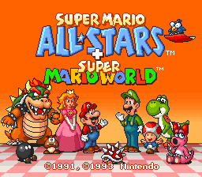
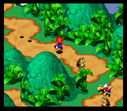
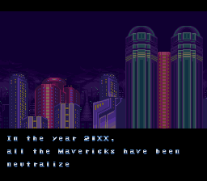
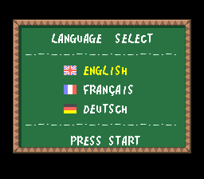
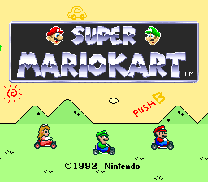

# Prisme

A Super Nintendo (SNES / Super Famicom) emulator written from scratch in Rust — CPU, PPU, a full audio path, and the SuperFX cartridge coprocessor, with no platform SDKs beyond a pure-Rust window/input/audio stack.

A plain-language walkthrough of how the whole thing works is in [`docs/emulateur-snes-explique.pdf`](docs/emulateur-snes-explique.pdf) (French).



*Super Mario All-Stars "SELECT GAME" menu, rendered by the emulator (background layers + sprites + color-math subscreen compositing).*

## Status

Playable rendering and audio for LoROM/HiROM games (NTSC and PAL), plus SuperFX cartridges.

| Area | State |
|---|---|
| 65C816 CPU | Full instruction set, emulation/native modes, BCD, interrupts, native-stack ops |
| SPC700 + IPL | Complete; runs games' real sound drivers |
| S-DSP audio | BRR, Gaussian interpolation, ADSR/GAIN, noise, pitch modulation, echo |
| PPU | BG modes 0–7 (2/4/8bpp), sprites, windows, color math, mosaic, HDMA, offset-per-tile, hires (5/6), interlace |
| Mode 7 | Rotation/scaling implemented + unit-tested; not yet gated on a real in-game screen |
| Cartridge coprocessors | SuperFX (GSU), SA-1, DSP-1 (HLE), CX4 (HLE) — all boot & render their real games |
| DMA | GDMA + HDMA (indirect, per-line) |
| Timing / IRQ | NMI, H/V IRQ ($4207–$420A), FastROM ($420D), open-bus (MDR) |
| Cartridge | LoROM / HiROM / SuperFX detection, region detection, battery SRAM |
| Frontend | winit + pixels window (resizable, fullscreen, zoom/filter/aspect-ratio), cpal audio, native macOS menu bar, ROM picker, save states, FPS overlay, headless PNG/WAV/trace dumps |

332 core unit tests pass. Verified end-to-end on eight commercial games: backgrounds, sprites,
color-math menus, real in-game music (WAV-analysed), input-driven gameplay (Mario runs, jumps and
scrolls a level), H/V-IRQ raster splits, battery saves, byte-identical save-state round-trips, and
all four cartridge coprocessors booting and rendering their real games — Yoshi's Island (SuperFX),
Super Mario RPG (SA-1), Super Mario Kart (DSP-1) and Mega Man X3 (CX4).

<p>
  
  
</p>
<p>
  
  
</p>

All four coprocessors are validated in real gameplay: Yoshi's Island (SuperFX) boots and renders,
Super Mario RPG (SA-1) plays the overworld, Mega Man X3 (CX4) reaches the title (with the CX4
scale/rotate logo animation) and opening-stage gameplay, and Super Mario Kart (DSP-1) renders a
live Mode 7 race — its perspective-projection math, the highest-risk part, works on a real track.

Known gaps: the Super Mario World *attract-mode intro* reaches gameplay but its cutscene state
machine doesn't advance to the overworld (diagnosed, root cause not yet isolated); Mode 7,
offset-per-tile, hires and interlace are implemented and unit-tested but not yet gated on a real
in-game screen (the DSP-1 Mode 7 path is now exercised via Super Mario Kart). See
`docs/PUNCHLIST.md` for the full list and `docs/IDEAS.md` for planned features.

## Build & run

Requires a recent stable Rust toolchain.

```sh
cargo build --release
cargo run --release -p prisme -- path/to/game.sfc   # or .smc / .zip
cargo run --release -p prisme                        # no path: opens a ROM picker
```

Launching without a ROM path (and without `--headless`) opens a native
file-open dialog filtered to `.sfc`/`.smc`/`.zip`, starting in `roms/` if that
directory exists. Cancelling the dialog exits cleanly. `--headless` still
requires an explicit ROM path (there is no window to attach a dialog to).

Controls:

| SNES | Key |
|---|---|
| D-pad | Arrow keys |
| B / A / Y / X | Z / X / A / S |
| L / R | Q / W |
| Start / Select | Enter / Right-Shift |

Emulator hotkeys (all platforms — these do not depend on the macOS-only menu
bar below): `P` pause, `N` frame-advance (while paused), `O` open a different
ROM (native file dialog; saves the current game's SRAM first, cancelling
keeps the current game running), `F5` save state, `F9` load state, `F7` next
save-state slot, `0`-`9` jump straight to that slot, `F6` reset (power-on
reset, keeps battery SRAM), `F8` export the current music as `.spc`, `F10`
toggle instant-resume-on-launch, `[`/`]` step the fast-forward factor (2/3/4×,
held with `Tab`), `F` toggle the FPS overlay, `M` mute, `+`/`-` volume, `F12`
screenshot, `F1`-`F4` set the window zoom to ×1-×4, `V` cycle the display
filter (Aucun/Lissé/CRT), `R` toggle the pixel-aspect-ratio mode
(pixel-perfect/TV authentique), `F11` toggle fullscreen (also Ctrl+Cmd+F on
macOS, that platform's own convention), `C` toggle the quit confirmation,
`Esc` exits fullscreen first if active, otherwise quits (asks for
confirmation unless disabled with `C`).

**Display: zoom, filter, aspect ratio (Phase 2).** The window is freely
resizable by dragging an edge/corner — `F1`-`F4` are convenience shortcuts
that jump straight to a given size, not the only way to resize. At any window
size the emulated picture is scaled without deformation: black letterbox/
pillarbox bars fill whatever the aspect ratio doesn't cover.
- **Ratio** (`R`, `Affichage > Ratio`): `Pixel-perfect (1:1)` snaps to the
  largest *whole-number* zoom that fits the window, so pixels stay perfectly
  sharp under the `Aucun` filter; `TV authentique (8:7)` stretches the
  picture to the SNES's actual non-square-pixel geometry (each native pixel
  is 8:7 wide:tall — a period CRT stretched this into the ~4:3 picture
  people remember) and fills the window continuously, not snapped to a whole
  factor.
- **Filter** (`V`, `Affichage > Filtre`), independent of zoom/ratio: `Aucun`
  (nearest-neighbor, sharp — the default), `Lissé` (bilinear), `CRT`
  (bilinear plus darkened alternating scanlines, for an "old TV" look).
  Implemented as a CPU post-processing pass over the RGBA output buffer
  (`frontend/src/render.rs`) rather than a custom wgpu shader — `pixels`
  0.15's built-in scaling renderer hard-codes nearest-neighbor sampling with
  no public option to switch it, and a full custom-shader integration was
  judged more surface than three filters need. Measured cost (Apple Silicon,
  `--release`): ~4ms/frame for the most expensive combination (CRT, zoom x4)
  at typical window sizes, well inside a 50-60fps budget; a window
  maximized on a 4K display with `CRT`/`Lissé` can exceed that budget (the
  default `Aucun` stays cheap at any size) — see
  `frontend/src/render.rs`'s `compose_frame_cost_*` tests for the numbers.
- **Fullscreen** (`F11` / Ctrl+Cmd+F on macOS): borderless fullscreen on the
  window's current monitor, same no-deformation scaling as windowed. Not
  persisted — the app always starts windowed. `Esc` exits fullscreen before
  it does anything else.
- All three (zoom, filter, ratio) are memorized in the preferences file;
  fullscreen is not.

The FPS overlay (off by default) draws the measured display frame rate in the
top-right corner, e.g. `FPS 60/50` (frames actually presented per
wall-second, averaged over a rolling ~0.5s window, versus the cartridge
region's native field rate — 60.0988 Hz NTSC / 50.007 Hz PAL). The number is
green while the emulator keeps up with the target rate and red if it falls
behind. It's drawn directly onto the presented `pixels` frame buffer (a tiny
built-in 3x5 bitmap font, no font asset) — and drawn *after* zoom/filter/PAR
scaling, at a fixed 1 output pixel per glyph pixel, so its on-screen size
stays small and constant regardless of window size instead of growing with
zoom/fullscreen. It never touches the core's own framebuffer, so it never
appears in `--dump-frame`/`--dump-frame-every` PNGs, the F12 screenshot, or
any other headless output. The transient bottom-left status messages (slot
saved, screenshot taken…) follow the same after-scaling, constant-size rule.

On macOS the windowed build also installs a native menu bar (top of screen).
Every item there also has a plain-keyboard equivalent (listed above) that
works on every platform, including Windows/Linux where this menu doesn't
exist:

| Menu | Item | Shortcut | Also reachable via |
|---|---|---|---|
| File | Open ROM… | Cmd+O | `O` |
| File | Capture d'écran | — | `F12` |
| File | Exporter la musique (.spc)… | — | `F8` |
| File | Demander confirmation avant de quitter | — | `C` |
| File | Quit | Cmd+Q | `Esc` |
| Emulation | Pause / Resume | Cmd+P | `P` |
| Emulation | Reset | Cmd+R | `F6` |
| Emulation | Save State | Cmd+S | `F5` |
| Emulation | Load State | Cmd+L | `F9` |
| Emulation | Slot N | — | digit key `N` (0-9) |
| Emulation | Slot suivant | — | `F7` |
| Emulation | Reprise instantanée | — | `F10` |
| Emulation | Accéléré > ×N | — | `[`/`]` (with `Tab` held) |
| Audio | Muet | Cmd+M | `M` |
| Audio | Volume +/− | Cmd+=/Cmd+- | `+`/`-` |
| Affichage | Show FPS | Cmd+F | `F` |
| Affichage | Zoom > ×N | — | `F1`-`F4` |
| Affichage | Filtre > Aucun/Lissé/CRT | — | `V` (cycles) |
| Affichage | Ratio > Pixel-parfait/TV authentique | — | `R` (toggles) |
| Affichage | Plein écran | Ctrl+Cmd+F | `F11` |

Keyboard hotkeys keep working alongside the menu; the checkable items
(mute, confirm-on-quit, show FPS, resume-on-launch, the slot,
fast-forward-factor, zoom, filter and ratio radio groups) stay in sync
whichever path is used.

Save states snapshot the whole console (CPU/PPU/APU/DSP/DMA and all RAM) to a
`.state` sidecar next to the ROM (e.g. `game.sfc` -> `game.state`; for a
`.zip`, next to the zip using its base name). `F5`/Cmd+S writes it; `F9`/Cmd+L
restores it. The blob stores no ROM image (the running ROM is reattached on
load) and carries the ROM's checksum, so loading a state saved from a different
game is rejected and the running game is left untouched. Any load error is
printed and emulation continues.

Battery-backed cartridges save to a `.srm` sidecar next to the ROM (e.g.
`game.sfc` -> `game.srm`; for a `.zip`, next to the zip using its base name).
The save loads on startup and is written back on exit — including when you quit
via Cmd+Q or the Quit menu item, not only via `Esc`/window-close — but only if
SRAM contents actually changed (an untouched save is never rewritten). Override
the path with `--save PATH`.

### Headless / debugging

```sh
cargo run --release -p prisme -- game.sfc --info                 # header, mapping, region
cargo run --release -p prisme -- game.sfc --headless --frames 600 --dump-frame out.png
cargo run --release -p prisme -- game.sfc --headless --frames 1500 --dump-audio out.wav
cargo run --release -p prisme -- game.sfc --headless --frames 900 --dump-state statedir/  # WRAM/VRAM/CGRAM/OAM
cargo run --release -p prisme -- game.sfc --disasm                # 65C816 disassembly from the reset vector
cargo run --release -p prisme -- game.sfc --trace t.log --trace-start-frame 0 --trace-end-frame 2      # 65C816
cargo run --release -p prisme -- game.sfc --trace-spc s.log --trace-start-frame 0 --trace-end-frame 2  # SPC700
cargo run --release -p prisme -- superfx.sfc --trace-gsu g.log --trace-start-frame 0 --trace-end-frame 2  # SuperFX GSU
cargo run --release -p prisme -- game.sfc --headless --frames 300 --script inputs.txt  # scripted joypad
cargo run --release -p prisme -- game.sfc --save /path/to/slot1.srm  # override the default .srm sidecar
```

The 65C816 trace is Mesen2-compatible for diffing against a reference emulator; the SPC700 and
GSU traces use the same idea for the audio CPU and the SuperFX coprocessor.

### macOS app bundle

`scripts/make-app.sh` builds a double-clickable `Prisme.app` (with icon) into `dist/`:

```sh
./scripts/make-app.sh              # release-build, then bundle
INSTALL=1 ./scripts/make-app.sh    # also copy into /Applications
SKIP_BUILD=1 ./scripts/make-app.sh # bundle the existing release binary (no rebuild)
```

Launched from Finder with no arguments, the app opens the ROM picker.

## Layout

- `core/` — `snes-core`, the pure emulation library (no I/O), fully testable headless.
  - `cpu/`, `ppu/`, `apu/`, `bus.rs`, `scheduler.rs`, `dma.rs`, `cartridge/`, `coprocessor/` (SuperFX/GSU), `debug/`
- `frontend/` — `prisme`, the winit/pixels/cpal binary and CLI (picker, menu bar, save states, FPS overlay, `render.rs` zoom/filter/aspect compositing).
- `scripts/` — `make-app.sh` (macOS `.app` bundler); `packaging/` — app icon assets.
- `docs/` — architecture, the pedagogical PDF, `PUNCHLIST.md` (known accuracy gaps), `IDEAS.md` (planned features).
- `.claude/` — development tooling: subagent definitions and a condensed, source-verified SNES hardware reference (`skills/snes-refs/references/`).

## ROMs

No game ROMs are included — they are copyrighted. Supply your own `.sfc`/`.smc`/`.zip` dumps of games you own. `roms/` is git-ignored.

## License

No license granted yet; all rights reserved by the author pending a choice of open-source license.
